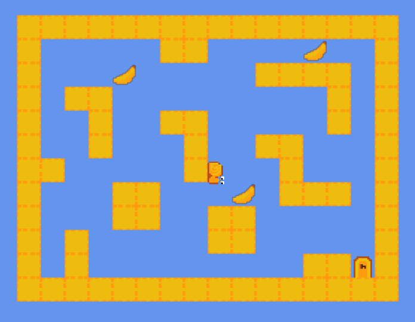

# 🐌 Banana Snail 🍌

[](https://www.python.org/)
[](https://api.arcade.academy/)
[](https://opensource.org/licenses/MIT)

Увлекательный 2D-платформер на движке **Python Arcade**, где вы управляете отважной улиткой, которая готова свернуть горы ради заветных бананов! Основная фишка игры — способность улитки прилипать к стенам и потолку, полностью меняя подход к исследованию уровней.



---

## ✨ Особенности игры

*   **Уникальная физика улитки:** Забудьте о привычной гравитации. Ползайте по полу, стенам и потолку, прыгайте под неожиданными углами.
*   **Эффекты:** частицы при приземлении, спрайты движения, которые автоматически отзеркаливаются и разворачиваются в зависимости от поверхности.
*   **Аудио-атмосфера:** Звуковое сопровождение для действий: сбор бананов, поиск ключа, открытие дверей.
*   **Система сохранения:** Автоматическое сохранение пройденных уровней и собранных бананов в файл `save.json`.

---

## 🎮 Управление

*   `A` / `D` (или `←/→`) — Перемещение по поверхности
*   `SPACE` — Отскок от поверхности
*   `ESCAPE` — Выход в главное меню

---

## 📂 Структура проекта

```text
banana-snail/
├── assets/
│   ├── images/          # Графические ассеты (игрок, блоки, предметы)
│   └── sounds/          # Звуковые эффекты (.mp3)
├── levels/              # JSON-файлы карт уровней
├── game.py              # Игровая логика, физика, камера и частицы
├── main.py              # Главное меню, UI и управление сохранениями
├── requirements.txt     # Зависимости проекта
└── save.json            # Файл сохранения прогресса

---

## 🛠️ Установка и запуск

1. Клонирование репозитория
Bash
git clone [https://github.com/grandfrog0/banana-snail](https://github.com/grandfrog0/banana-snail)
cd banana-snail
2. Настройка виртуального окружения
Bash
python -m venv venv
# Для Windows:
venv\Scripts\activate
# Для macOS/Linux:
source venv/bin/activate
3. Установка зависимостей
Bash
pip install -r requirements.txt
4. Запуск игры
Bash
python main.py

---

## 📝 Лицензия
Проект распространяется под лицензией MIT. Вы можете свободно использовать, модифицировать и развивать этот код.
